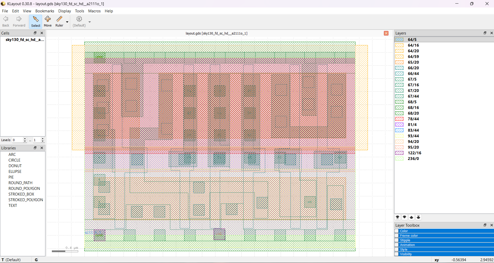
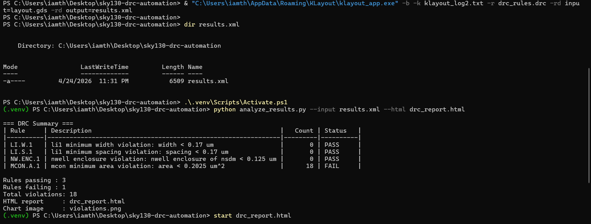
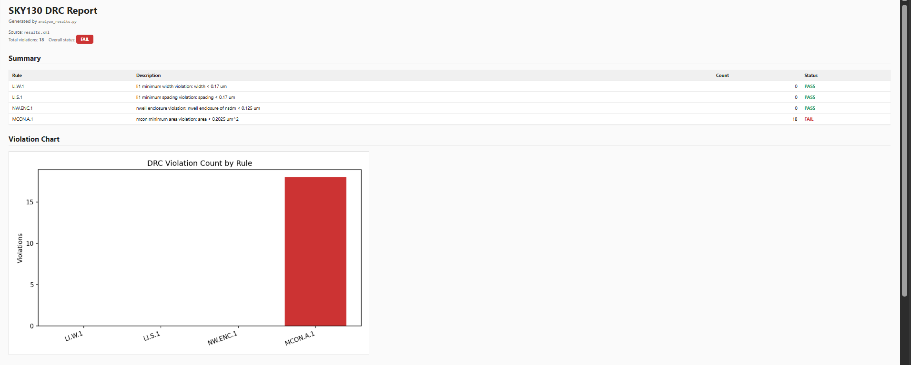
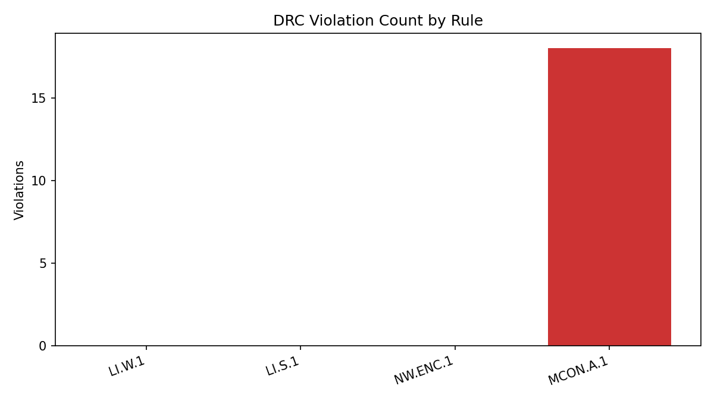

# SKY130 DRC Automation Project

A small Physical Verification project using **KLayout**, **Python**, **TCL**, and a real **SKY130 standard-cell GDS layout**.

This project runs a custom DRC rule deck on a SKY130 layout, exports KLayout DRC results to XML, parses the violations with Python, and generates an HTML dashboard with a summary table, violation chart, and violation details.

> This is a scoped educational DRC project, not a full production Calibre rule deck.

---

## Demo Screenshots

### SKY130 Layout Opened in KLayout



### DRC Flow Running from PowerShell



### Generated HTML DRC Dashboard



### Violation Chart



---

## Project Result

The flow successfully ran on a SKY130 standard-cell layout.

| Metric | Result |
|---|---:|
| Total rules checked | 4 |
| Rules passing | 3 |
| Rules failing | 1 |
| Total violations | 18 |

The failing rule was:

| Rule | Description | Violations |
|---|---|---:|
| MCON.A.1 | mcon minimum area violation: area < 0.2025 um² | 18 |

The other rules passed with zero violations:

| Rule | Description | Status |
|---|---|---|
| LI.W.1 | li1 minimum width < 0.17 um | PASS |
| LI.S.1 | li1 minimum spacing < 0.17 um | PASS |
| NW.ENC.1 | nwell enclosure of nsdm < 0.125 um | PASS |

A sample generated report is included here:

[Open sample DRC HTML report](docs/sample_drc_report.html)

---

## What This Project Does

The project automates a mini Physical Verification flow:

1. Loads a GDS layout into KLayout.
2. Runs custom DRC rules.
3. Exports violations to `results.xml`.
4. Parses the XML results using Python.
5. Generates:
   - terminal summary table
   - violation bar chart
   - HTML dashboard

---

## Why DRC Matters

DRC, or Design Rule Checking, verifies that an IC layout follows the physical manufacturing constraints of a process technology.

Examples of DRC checks include:

- minimum wire width
- minimum spacing between shapes
- layer enclosure
- minimum polygon area

In a real semiconductor flow, DRC is required before tapeout because layout violations can cause manufacturing failures.

---

## Tool Stack

| Tool | Purpose |
|---|---|
| KLayout | Layout viewer and DRC engine |
| Python | Automation and report generation |
| TCL | Optional batch automation script |
| SKY130 | Open-source 130 nm PDK/layout data |
| Git/GitHub | Project version control and portfolio display |

---

## Files

| File | Purpose |
|---|---|
| `drc_rules.drc` | Custom KLayout DRC rule deck |
| `run_drc.py` | Python script that runs KLayout DRC in batch mode |
| `analyze_results.py` | Parses DRC XML and generates report files |
| `run_drc.tcl` | Optional TCL batch automation script |
| `requirements.txt` | Python package dependencies |
| `README.md` | Project documentation |
| `docs/images/` | Screenshots and report images |
| `docs/sample_drc_report.html` | Example generated report |

---

## DRC Rules Implemented

| Rule ID | Layer(s) | Check | Limit |
|---|---|---|---|
| LI.W.1 | li1 `67/20` | Minimum width | 0.17 um |
| LI.S.1 | li1 `67/20` | Minimum spacing | 0.17 um |
| NW.ENC.1 | nwell `64/20`, nsdm `93/44` | nwell enclosure of nsdm | 0.125 um |
| MCON.A.1 | mcon `67/44` | Minimum area | 0.2025 um² |

---

## Setup

Install Python dependencies:

```bash
python -m pip install -r requirements.txt